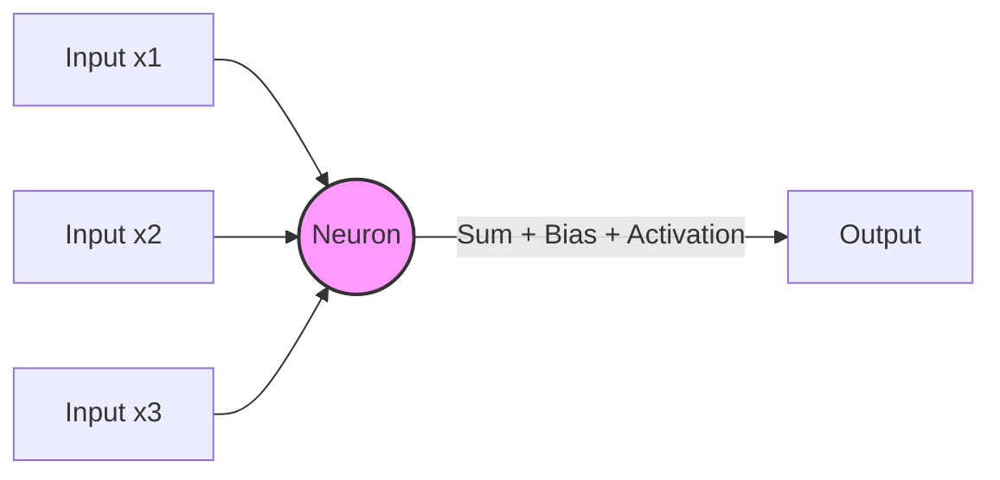

# Section 1: Artificial Neural Networks

## 1. Introduction: From Biology to Silicon
Before we can build a brain, we must understand the one we already have.

### The Biological Neuron
Your brain is made of billions of cells called **neurons**.
- **Dendrites**: The "Ears". They receive chemical signals from other neurons.
- **Cell Body (Soma)**: The "Processor". It sums up all the incoming signals.
- **Axon**: The "Mouth". If the signal is strong enough (passes a threshold), it fires an electrical pulse to the next neuron.

### The Artificial Neuron (Perceptron)
Scientists mimicked this biology with math.
1.  **Inputs ($x$)**: The data coming in (e.g., pixels of an image).
2.  **Weights ($w$)**: The strength of the connection. Think of this as a "sensitivity" knob.
    - High weight = This input matters a lot.
    - Low weight = Ignore this input.
3.  **Bias ($b$)**: An extra threshold to shift the activation.
4.  **Activation Function**: The mathematical decision rule (e.g., "If sum > 0.5, output 1, else 0").

$$ Output = Activation(\sum (Inputs * Weights) + Bias) $$



---

## 2. Artificial Neural Networks (ANN)
One neuron is dumb. A billion neurons are smart.
We stack neurons into layers:
1.  **Input Layer**: Receives raw data.
2.  **Hidden Layers**: The layers in between. They process features.
    - Early layers might recognize "edges" in a photo.
    - Later layers might recognize "eyes" or "noses".
3.  **Output Layer**: Gives the final answer ("Cat" or "Dog").

---

## 3. How Machines Learn: Backpropagation
A fresh Neural Network is stupid. It guesses randomly. To make it smart, we use a loop:

1.  **Forward Propagation (The Prediction)**
    - Data flows from Input -> Hidden -> Output.
    - The network says: "I am 60% sure this is a Dog."
    
2.  **Loss Calculation (The Scorecard)**
    - Reality: It was a Cat.
    - Loss (Error): "You were wrong by a lot."

3.  **Backpropagation (The Blame Game)**
    - This is the most crucial concept.
    - We use calculus (Chain Rule) to go **backward** from the output to the input.
    - We figure out *which* specific neuron contributes most to the error.
    - "Neuron #45 was too loud! Turn its weight down."
    - "Neuron #12 was too quiet! Turn its weight up."

4.  **Update**: Tweaking the weights slightly using an "Optimizer" (like SGD or Adam).

Repeat this millions of times, and the network becomes an expert.

---

## 4. Code Corner: The Single Neuron
Let's translate the math into Python. A neuron is just a function that takes inputs and weights.

```python
import numpy as np

def sigmoid(x):
    # Activation function: squishes numbers between 0 and 1
    return 1 / (1 + np.exp(-x))

def neuron(inputs, weights, bias):
    # 1. Multiply inputs by weights
    # 2. Sum them up (Dot Product)
    # 3. Add bias
    total_signal = np.dot(inputs, weights) + bias
    
    # 4. Apply activation
    return sigmoid(total_signal)

# Example: Predicting if a picture is a "Cat"
# Features: [Has_Whiskers (0 to 1), Has_Pointy_Ears (0 to 1)]
my_inputs = np.array([0.9, 0.8])  # Very whiskery, very pointy ears

# Weights: How important is each feature?
my_weights = np.array([5.0, 2.0]) # Whiskers are huge indicators

# Bias: General threshold
my_bias = -4.0 

output = neuron(my_inputs, my_weights, my_bias)
print(f"Probability this is a cat: {output:.4f}")
```

