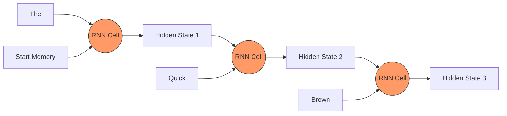

# Section 2: Text Processing & RNNs

## 1. The Limitation of Standard ANNs
The Neural Networks from Section 1 are great for images. Why? Because an image is static. A 64x64 pixel image is always 4,096 numbers.

**Language is different.**
- "Hi" is 1 word.
- "The quick brown fox jumps..." is 6 words.
- Sentences vary in length.
- **Order matters**: "Dog bites Man" is very different from "Man bites Dog".

Standard ANNs cannot handle variable-length sequences or order well.

---

## 2. Recurrent Neural Networks (RNNs)
To fix this, scientists invented the **RNN**.
- It has a "hidden state" (memory).
- It processes text **one word at a time**.

**The Process:**
1.  Read Word 1 ("The"). Update Memory.
2.  Read Word 2 ("Quick"). Combine "Quick" with Memory of "The". Update Memory.
3.  Read Word 3 ("Brown"). Combine with Memory of "The Quick". Update Memory.

By the end of the sentence, the "Memory" should theoretically contain the meaning of the whole sentence.




---

## 3. The Vanishing Gradient Problem
RNNs have a fatal flaw: **Short-Term Memory**.
As you train them (using Backpropagation through time), the gradients (signals for learning) get smaller and smaller as they go back.
- By the time the network reaches the 100th word, it has completely forgotten the 1st word.
- *Analogy*: It's like trying to remember a telephone game message passed through 100 people.

---

## 4. LSTM (Long Short-Term Memory)
The solution was the **LSTM** (and its cousin, the GRU).
- An LSTM is a smarter neuron.
- It has dedicated **Gates**:
    1.  **Forget Gate**: "Should I keep this old info?"
    2.  **Input Gate**: "Is this new word important?"
    3.  **Output Gate**: "What should I pass to the next step?"

LSTMs became the standard for Google Translate and Siri for years. They could remember context over longer paragraphs.

**The Remaining Bottleneck**: They form a **queue**. You cannot process Word #100 until you have finished Word #99. This makes training extremely slow on large datasets because you can't parallelize it across GPU cores.

---

## 5. Code Corner: A Simple RNN Loop
Here is how an RNN processes a sentence concept-by-concept (word-by-word) in Python.

```python
import numpy as np

# A simulated "Meaning" dictionary (Embeddings)
word_embeddings = {
    "The":   np.array([ 0.1,  0.1]),
    "Quick": np.array([ 0.5, -0.2]),
    "Fox":   np.array([-0.3,  0.9])
}

sentence = ["The", "Quick", "Fox"]

# Initialize Memory (Hidden State) as all zeros
memory = np.array([0.0, 0.0])

print(f"Start Memory: {memory}")

# Loop through the sentence (Recurrence)
for word in sentence:
    current_input = word_embeddings[word]
    
    # Simple RNN Logic: New Memory = Input + Old Memory
    # (Real RNNs multiply by weights first, but this is the logic)
    memory = memory + current_input
    
    print(f"Read '{word}'. Updated Memory: {memory}")

print(f"Final Sentence Meaning Vector: {memory}")
```

