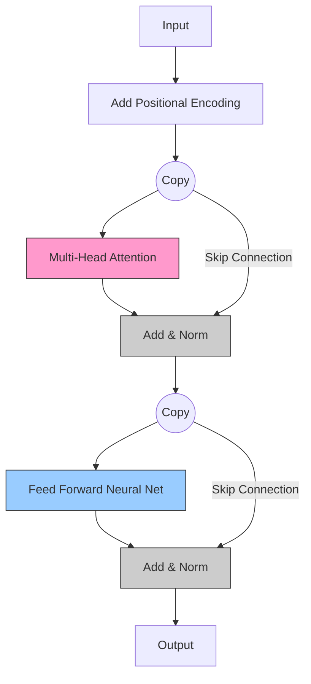

# Extended Concepts: Deep Dive into the Transformer

So you've read "Attention Is All You Need" and you know that "Attention" is just calculating similarity scores between words. 

But if you just run a Dot Product on a bag of words, you're missing huge pieces of the puzzle. How does it know the order of words? How does it look for multiple things at once? And how does it generate text without cheating?

This guide breaks down the **mechanics** of the Transformer for a future AI Engineer.

---

## 1. Positional Encodings: The "Index Card" Problem

**The Problem**: Attention is **parallel**. It looks at "Dog bites Man" and processes "Dog", "bites", and "Man" all at the same time. To the math, "Man bites Dog" looks exactly the same because the set of words is identical.

**The Solution**: We must **inject** order information into the embeddings before they enter the model.

### The Analogy
Imagine shuffling a deck of cards. You lose the order. But if you write "1", "2", "3" on the corners before shuffling, you can reconstruct the sequence.

### Code Corner: Adding Order
In the original paper, they use sine waves (math magic). But effectively, we just add a "Position Vector" to our "Word Vector".

```python
import numpy as np

# A simplified embedding for "Dog" (3 dimensions)
# Let's say it represents [Furry, Friendly, Small]
embedding_dog = np.array([0.9, 0.8, 0.2])

# Position 0 Vector (The first word in a sentence)
# The model learns that this pattern means "Start of sentence"
pos_encoding_0 = np.array([0.01, 0.01, 0.01]) 

# Position 10 Vector (The 10th word)
pos_encoding_10 = np.array([0.5, -0.5, 0.5])

# Final Input to the model
input_start = embedding_dog + pos_encoding_0
input_later = embedding_dog + pos_encoding_10

print(f"Dog at Start: {input_start}")
print(f"Dog at End:   {input_later}")
# Notice: The vector is SLIGHTLY different. The model can tell the difference!
```

---

## 2. Multi-Head Attention: The "Manager" Analogy

**The Problem**: A single Attention mechanism can only focus on one relationship. 
- Maybe it links "Bank" to "River".
- But what if we also need to link "Bank" to "Deposited" *at the same time*?

**The Solution**: Don't use one brain. Use 8 smaller brains (**Heads**) running in parallel.

### The Analogy
Imagine you are hiring a team to review a movie script:
1.  **Head 1 (The Fact Checker)**: Checks if the dates and history are correct.
2.  **Head 2 (The Gramma Nazi)**: Checks for spelling errors.
3.  **Head 3 (The Emotional Reader)**: Checks if the tone is sad or happy.
4.  **Head 4 (The Connector)**: Checks which characters are related.

They all read the *same script*, but they extract *different information*. Finally, the Boss (Linear Layer) combines their reports.

### Code Corner: Splitting Heads
```python
# Imagine our word embedding has 4 dimensions
embedding = np.array([1.0, 2.0, 3.0, 4.0])

# We want 2 Heads. So each head gets 2 dimensions.
# This happens conceptually via matrix multiplication, but here's the intuition:

head_1 = embedding[0:2] # [1.0, 2.0] -> Focuses on Syntax?
head_2 = embedding[2:4] # [3.0, 4.0] -> Focuses on Meaning?

# Head 1 runs its own attention logic
# Head 2 runs its own attention logic

# Finally, we adhere them back together
result = np.concatenate([head_1, head_2])
```

---

## 3. Masked Attention: No Spoilers Allowed

**The Problem**: In **GPT** (Decoder models), we are training the model to predict the next word.
- Input: "The quick brown..."
- Target: "fox"

If we let the Attention mechanism look at the *whole sentence* during training ("The quick brown fox jumps"), it will "cheat". It will see the word "fox" exists at position 4 and just copy it.

**The Solution**: A **Mask**. We force the model to look only at the past, not the future.

### The Mechanism
We use a matrix where the future positions are set to **Negative Infinity**. When we apply Softmax (to get probabilities), these turn to **Zero**.

### Visual
A "1" means the model CAN see that position. A "0" (or $-\infty$ in math terms) means it is BLOCKED.

|       | Word 1 | Word 2 | Word 3 | Word 4 |
|-------|--------|--------|--------|--------|
| **Pos 1** | **1**  | 0      | 0      | 0      |
| **Pos 2** | **1**  | **1**  | 0      | 0      |
| **Pos 3** | **1**  | **1**  | **1**  | 0      |
| **Pos 4** | **1**  | **1**  | **1**  | **1**  |
*   Row 1 can only see Col 1.
*   Row 2 can see Col 1 & 2.
*   Row 3 cannot see Col 4 (Future).

### Code Corner: The Mask
```python
def softmax(x):
    e_x = np.exp(x - np.max(x)) # Subtract max for stability
    return e_x / e_x.sum()

# Attention Scores (Pre-Softmax)
# Let's say we have 3 words.
# [Word 1, Word 2, Word 3] predicting [Word 2, Word 3, Word 4]
scores = np.array([
    [10.0,  9.0,  5.0],  # Word 1 scores against 1, 2, 3
    [ 7.0, 12.0,  6.0],  # Word 2 scores
    [ 2.0,  5.0, 11.0]   # Word 3 scores
])

# THE MASK (Values of -inf mean "OFF LIMITS")
mask = np.array([
    [0,    -999, -999], # Word 1 can only see itself
    [0,       0, -999], # Word 2 can see 1 & 2
    [0,       0,    0]  # Word 3 can see 1, 2, 3
])

masked_scores = scores + mask

print("Masked Scores:\n", masked_scores)
# Notice the -999s. When you Softmax this, those become 0 probability.
```

---

## 4. Residual Connections: The "Save Point"

**The Problem**: Deep networks (like GPT-4 with 100+ layers) are like a game of "Telephone". As the signal passes through layer after layer, the original message ("The cat sat on the mat") can get distorted or lost.

**The Solution**: **Add** the original input back to the output of the layer.
$$ Output = Layer(Input) + Input $$

### The Analogy
Imagine editing a photo.
1.  **Without Residual**: You take a photo, apply a filter, then apply another, and another. Eventually, the original image is destroyed.
2.  **With Residual**: You keep a transparent copy of the original and "blend" it with the edits at every step. This preserves the core identity of the image.

### Code Corner: The Skip Connection
```python
x = np.array([1.0, 0.5]) # The signal

# A Layer (e.g., Attention Block) that transforms x
# Suppose this layer messes up and outputs almost nothing
layer_output = np.array([0.01, -0.01]) 

# Residual Connection (The Savior)
final_output = layer_output + x 

print(f"Result: {final_output}")
# Result is [1.01, 0.49]. 
# Even though the layer failed, we preserved the original info!
# This allows gradients to flow through 100s of layers easily.
```

---

## Summary Diagram: The Transformer Encoder Block

Putting it all together, a single "Block" of a Transformer looks like this:


