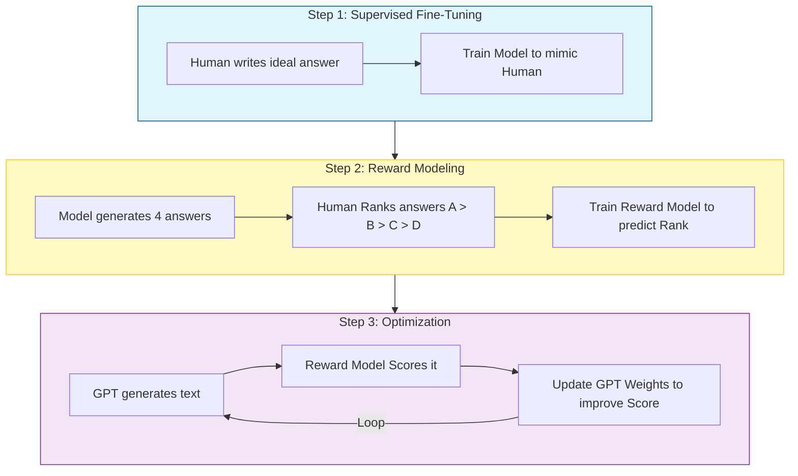

# Section 4: Delving Deeper into GPT

## 1. What is GPT?
**G**enerative **P**re-trained **T**ransformer.

- **Generative**: It generates new data (next tokens).
- **Pre-trained**: It learns general language patterns first, before learning specific tasks.
- **Transformer**: It uses the Self-Attention architecture.

---

## 2. The Evolution of GPT

### GPT-1 (2018) - The Experiment
- **Size**: 117 Million Parameters.
- **Idea**: "Can we train a Transformer on books and then fine-tune it for sentiment analysis?"
- **Result**: It worked better than expected.

### GPT-2 (2019) - The Scaler
- **Size**: 1.5 Billion Parameters.
- **Data**: Trained on Reddit links (WebText).
- **Shock**: It could write coherent essays and fake news. OpenAI was scared to release it.
- **Optimization**: Zero-Shot learning appeared (it could do tasks it wasn't explicitly trained for).

### GPT-3 (2020) - The Behemoth
- **Size**: 175 Billion Parameters.
- **Capability**: It could write code, poetry, SQL, and translate languages.
- **The limit**: It was a raw "Autocomplete" engine. It didn't follow instructions.
    - *User*: "Tell me a joke."
    - *GPT-3*: "Tell me a joke. Two guys walk into a bar..." (It just completed the text).

---

## 3. RLHF: Making ChatGPT
To turn raw GPT-3 into ChatGPT, OpenAI applied **RLHF (Reinforcement Learning from Human Feedback)**. This aligns the model to be **Helpful, Harmless, and Honest**.

### Step 1: SFT (Supervised Fine-Tuning)
"Demonstration Phase".
- Humans write thousands of prompts and **ideal responses**.
- The model trains on this dataset specifically.
- *Learns*: "When I see a question, I answer it."

### Step 2: Reward Modeling
"Comparison Phase".
- The model generates 4 answers to a prompt.
- A human ranks them (Best -> Worst).
- A separate neural network (Reward Model) learns to predict what humans like.

### Step 3: PPO (Proximal Policy Optimization)
"Optimization Phase".
- The main GPT model generates answers.
- The Reward Model grades them.
- PPO adjusts the GPT weights to maximize the grade.
- This automated loop allows millions of training steps without human intervention.

