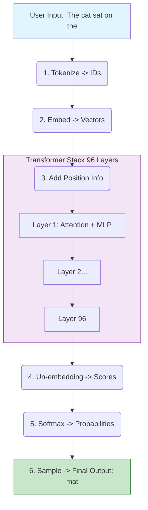

# The Life of a Prompt: GPT Architecture Walkthrough

We have learned about Neurons, Attention, and Tokens. Now, let's put it ALL together.
In this guide, we will trace the journey of a single sentence as it travels through a GPT model to generate a response.

**The Mission**: We want the model to complete the sentence:
> **Input**: "The cat sat on the"
> **Expected Output**: "mat"

---

## Step 1: Tokenization (The Translator)
The model does not understand English letters. It only understands numbers.

1.  **Input**: "The cat sat on the"
2.  **Tokenizer**: Breaks it down and assigns IDs from a giant dictionary (vocabulary).
    *   "The" -> `464`
    *   " cat" -> `3797`
    *   " sat" -> `3388`
    *   " on" -> `319`
    *   " the" -> `262`

**Current State**: `[464, 3797, 3388, 319, 262]`

---

## Step 2: Embedding Layer (The Look Up)
The model looks up these IDs in its "Memory Bank" (Embedding Matrix). 
*   It retrieves the **Meaning Vector** for each word.
*   It adds the **Positional Encoding** (so it knows "The" is 1st and "the" is 5th).

**Current State**: A list of 5 vectors.
*   `Vector(The) + Pos(0)`
*   `Vector(cat) + Pos(1)`
*   ...and so on.

---

## Step 3: The Transformer Blocks (The Brain)
This is the deep part. The data flows through 96 layers (in GPT-3). In each layer, two things happen:

### A. Attention (The Contextualizer)
The model asks: *"How do these words relate to each other?"*
*   The word at position 5 ("the") looks back at "cat" (pos 1) and "sat" (pos 2).
*   It realizes: *"Okay, we are talking about a **cat** doing the action of **sitting**."*
*   It updates the vector for "the" (pos 5) to absorb this context.

### B. Feed Forward (The Knowledge Retrieval)
The model asks: *"What do I know about cats sitting?"*
*   The neurons in this layer fire. They store facts like "cats sit on mats", "cats sit on sofas", "cats sit on laps".
*   The vector gets pushed towards these concepts.

**Current State (after 96 layers)**: The vector for the last word ("the") has been transformed. It now mathematically represents the concept: **"An object that a cat usually sits on."**

---

## Step 4: The Un-embedding (The Prediction)
Now we turn this complex "concept vector" back into a word.

1.  **Matrix Multiplication**: We verify the final vector against *every single word* in the dictionary (50,000+ words).
2.  **Logits**: We get a score for every word.
    *   "mat": Score 15.0 (High match)
    *   "floor": Score 12.0
    *   "couch": Score 10.0
    *   "pizza": Score -5.0 (Cats don't specificially sit on pizza usually)

---

## Step 5: Softmax & Sampling (The Selection)
We turn scores into probabilities (%).

1.  **Softmax**:
    *   "mat": 85%
    *   "floor": 10%
    *   "couch": 4%
    *   ...others: 1%

2.  **Sampling**:
    *   **Temperature = 0**: We pick "mat" (Highest %).
    *   **Temperature = 1**: We mimic rolling a dice. We *might* pick "floor", but "mat" is most likely.

**Final Output**: "mat"

---

## Code Corner: A Mini-GPT Forward Pass
If we stripped away all the training complexity and just wrote the prediction logic in pure Python/NumPy, it looks like this:

```python
import numpy as np

def softmax(x):
    e_x = np.exp(x - np.max(x))
    return e_x / e_x.sum()

# 1. VOCABULARY
id_to_word = {0: "The", 1: "cat", 2: "sat", 3: "on", 4: "mat", 5: "dog"}
word_to_id = {v: k for k, v in id_to_word.items()}
vocab_size = len(id_to_word)
embed_dim = 4 # Tiny embedding size for demo

# 2. FAKE WEIGHTS (Randomly initialized for demo)
# Embedding Matrix (vocab_size x embed_dim)
W_E = np.random.randn(vocab_size, embed_dim) 
# Un-embedding Matrix (Output layer)
W_U = np.random.randn(embed_dim, vocab_size)

def predict_next_word(sentence):
    # A. TOKENIZATION
    # Split sentence into words
    tokens = [word_to_id[w] for w in sentence.split()]
    
    # B. EMBEDDING
    # Just grab the vectors for the numbers
    vectors = W_E[tokens] # Shape: (seq_len, embed_dim)
    
    # C. TRANSFORMER BLOCKS (Simplified)
    # Ideally: Attention -> FeedForward -> Normalize...
    # Here: We just average them to simulate "context"
    final_vector = np.mean(vectors, axis=0)
    
    # D. OUTPUT PROJECTION (Logits)
    # Dot product with every word in vocabulary
    logits = np.dot(final_vector, W_U) # Shape: (vocab_size)
    
    # E. PROBABILITIES
    probs = softmax(logits)
    
    # Identify the best word
    best_id = np.argmax(probs)
    return id_to_word[best_id], probs

# RUN IT
input_text = "The cat sat on"
predicted_word, all_probs = predict_next_word(input_text)

print(f"Input: '{input_text}'")
print(f"Predicted Next Word: '{predicted_word}'")
```

---

## Visual Summary


