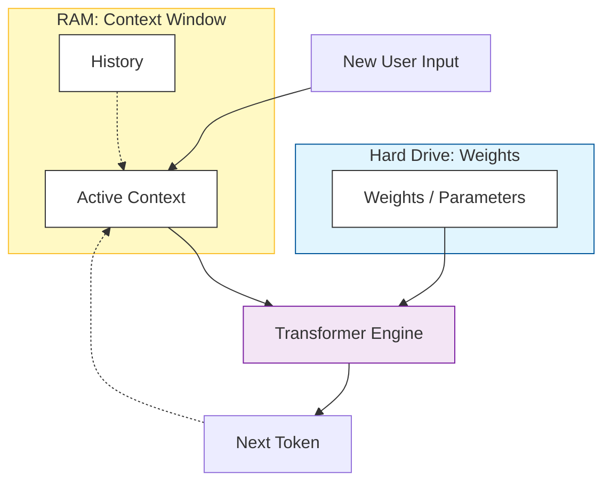

# Weights, Parameters, and Context Windows

You often hear: "Llama-3-70B has 70 Billion parameters!" or "Claude has a 200k Context Window!"

But what does that actually mean? 
If the model is a computer, the **Weights** are the Hard Drive (Knowledge), and the **Context Window** is the RAM (Working Memory).

---

## 1. Model Weights (Parameters)

### What are they?
Physically, a model is just a giant file (like `pytorch_model.bin` or `model.safetensors`) consisting of gigabytes of floating-point numbers (e.g., `0.1245`, `-0.992`). 
These numbers are the **Weights**.

### The Analogy: The "Frozen" Brain
Imagine a human brain preserved in ice. All the neurons and connections are there, but they are frozen still.
*   **Training**: This is when the brain is alive and learning. The connections (weights) are changing, growing, and shrinking based on what it reads.
*   **Inference (Using the AI)**: We take a snapshot of that brain. When you chat with ChatGPT, **its weights do NOT change**. It does not "learn" from you. It processes your input through its frozen pathways.

### Why "70 Billion"?
The more parameters (synapses) you have, the more nuanced concepts you can store.
*   **1B params**: Can speak English, but makes grammar mistakes.
*   **7B params**: Good grammar, knows basic facts, can code simple scripts.
*   **100B+ params**: Undergraduate level knowledge, complex reasoning, nuance.

### Code Corner: Visualizing Weights
A weight matrix effectively stores relationships.

```python
import numpy as np

# Imagine a tiny layer of a neural network.
# It tries to detect features: [Is_Furry, Is_Metal, Has_Wheels]
# Input: "Cat" -> [1, 0, 0]

# The Weights determine the output decisions.
# Rows: [Is_Animal, Is_Vehicle]
weights = np.array([
    [0.9, -0.1, -0.5], # Neuron 1 (Detects Animals): Likes Furry, Hates Metal/Wheels
    [-0.8, 0.9,  0.9]  # Neuron 2 (Detects Vehicles): Hates Furry, Likes Metal/Wheels
])

input_cat = np.array([1, 0, 0]) # Furry=1

# The calculation (Inference)
decision = np.dot(weights, input_cat) 

print(f"Animal Score: {decision[0]}") # 0.9 (High Confidence)
print(f"Vehicle Score: {decision[1]}") # -0.8 (Negative Confidence)
```

---

## 2. Context Window

### What is it?
If Weights are the "Hard Drive" (Long-term knowledge), the **Context Window** is the **RAM** (Short-term working memory).

It is the maximum amount of text (tokens) the model can look at **right now** to generate the next word.

### The Analogy: The Exam Sheet
Imagine you are taking an Open Book Exam.
*   **The Book**: The Training Data (The Internet). The model has *already* read this and compressed it into its Weights. It doesn't have the book in front of it.
*   **The Exam Paper**: The Context Window. This is the question paper plus whatever rough notes you are writing *right now*.
*   **The Limit**: You only have 1 single sheet of paper. If the conversation gets too long, you have to erase the top of the page to write at the bottom. **You forget what was at the top.**

### Why is it limited?
Because **Attention** (Concept from File 03) compares *every word to every other word*.
*   10 words = 100 comparisons.
*   100 words = 10,000 comparisons.
*   100,000 words = 10,000,000,000 comparisons.

The math gets exponentially harder as context grows (Quadratic Complexity: $O(N^2)$). That's why models with 1 Million context are an engineering miracle.

### Code Corner: The Sliding Window
This is exactly how a chatbot manages your memory.

```python
# A simple simulation of a limited context window
MAX_CONTEXT = 5  # Can only remember 5 tokens
chat_history = []

def chat(new_message):
    # 1. Add new message to memory
    chat_history.append(new_message)
    
    # 2. Check if we are "full"
    current_length = len(chat_history)
    
    if current_length > MAX_CONTEXT:
        # 3. FORGET the old stuff (Truncate)
        forget_count = current_length - MAX_CONTEXT
        print(f"⚠️ Memory full! Forgetting: {chat_history[:forget_count]}")
        del chat_history[:forget_count]
        
    print(f"Current Context (What AI sees): {chat_history}")

# Simulation
chat("Hi, my name is John.") # T1
chat("I like tacos.")        # T2
chat("What is 2+2?")         # T3
chat("The answer is 4.")     # T4
chat("Where are you from?")  # T5 (Full)
chat("Wait, what is my name?") # T6 (Overflow!)
```

---

## 3. The Grand Architecture Diagram

Here is how Weights and Context interact during a chat.


