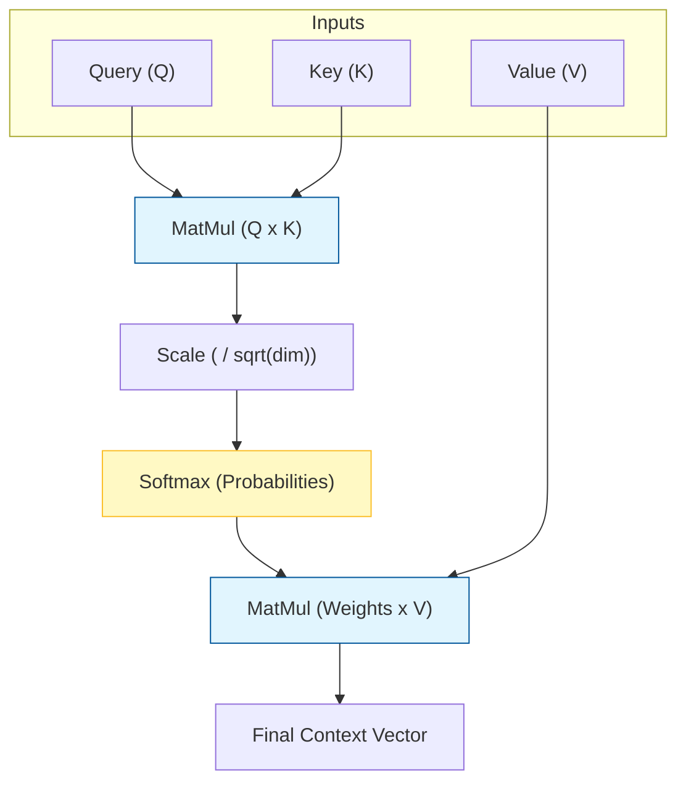

# Deep Dive Notes: Transformer Architecture Explained

These notes capture the core engineering concepts from the "Transformer Architecture Explained" deep dive. 
The central piece of the puzzle that often confuses people is the **Query, Key, and Value (Q, K, V)** mechanism. 

This guide breaks that single concept down for a 20-year-old developer.

---

## 1. The "Database" Analogy (Q, K, V)

In computer science, a database works like this:
1.  **Query**: You search for "Action Movies".
2.  **Key**: The database checks its genre tags (Keys).
3.  **Value**: It returns the actual movie usage (Values) for the matches.

The Transformer does the **exact same thing** with math.

### The Breakdown
Every word in a sentence produces 3 vectors:
*   **Query ($Q$)**: "What am I looking for?"
*   **Key ($K$)**: "What do I contain?"
*   **Value ($V$)**: "If you choose me, here is my information."

### Example: "The cat sat"
1.  **"Sat" (The specific word we are processing)** sends out a **Query**: *"I am an action verb. I am looking for my subject (who did it?)."*
2.  **"Cat"** holds up a **Key**: *"I am a noun/entity."*
3.  **"The"** holds up a **Key**: *"I am an article."*

The Math (Dot Product) checks the match:
*   `Query(Sat) . Key(Cat)` = **High Score** (Verbs love Nouns).
*   `Query(Sat) . Key(The)` = **Low Score**.

Since "Cat" matches, "Sat" absorbs the **Value** of "Cat". "Sat" now "knows" it was the cat that sat.

---

## 2. Scaled Dot-Product Attention ( The Math)

The formula looks scary, but it's just the story above in one line:

$$ Attention(Q, K, V) = softmax(\frac{QK^T}{\sqrt{d_k}})V $$

1.  **$QK^T$**: Multiply Queries by Keys to get "Similarity Scores".
2.  **$\sqrt{d_k}$**: Divide by a constant (scaling) so numbers don't get too huge (~stability).
3.  **Softmax**: Convert scores to percentages (Probability).
4.  **$V$**: Multiply by Values to get the final mixed vector.

---

## 3. Code Corner: Implementing Q, K, V

Here is the actual Python code you would find inside PyTorch or a from-scratch implementation.

```python
import numpy as np

def scaled_dot_product_attention(query, key, value):
    """
    query: what we are looking for
    key:   what labels exist
    value: actual content
    """
    d_k = query.shape[-1] # Dimension size (e.g. 64)
    
    # 1. MatMul (Similarity Scores)
    # Transpose key so we can multiply [Length x Dim] by [Dim x Length]
    scores = np.dot(query, key.T) 
    
    # 2. Scale
    scores = scores / np.sqrt(d_k)
    
    # 3. Softmax (Top marks get high %, others get 0)
    # "Softmax" makes sure rows sum to 1.0 (100%)
    exp_scores = np.exp(scores - np.max(scores, axis=-1, keepdims=True))
    weights = exp_scores / np.sum(exp_scores, axis=-1, keepdims=True)
    
    # 4. MatMul with Value
    # This effectively "retrieves" the info from high-scoring words
    output = np.dot(weights, value)
    
    return output, weights

# --- DEMO ---
# 3 Words (Rows), 4 Dimensions (Columns)
# Words: [Cat, Sat, On]
# Ideally, "Sat" (Row 1) should attend to "Cat" (Row 0)

# Randomly initialized matrices for demo
Q = np.array([
    [0.1, 0.0, 0.0, 0.1], # Cat Query
    [0.0, 1.0, 0.0, 0.0], # Sat Query (Looking for "Nouns" in dim 1)
    [0.0, 0.0, 1.0, 0.0]  # On Query
])

K = np.array([
    [0.0, 1.0, 0.0, 0.0], # Cat Key (Has "Noun" feature in dim 1)
    [1.0, 0.0, 0.0, 0.0], # Sat Key
    [0.0, 0.0, 0.0, 1.0]  # On Key
])

V = np.array([
    [5, 5, 5, 5], # Cat's Information
    [1, 1, 1, 1], # Sat's Information
    [9, 9, 9, 9]  # On's Information
])

output, attention_weights = scaled_dot_product_attention(Q, K, V)

print("Attention Weights for 'Sat' (Row 1):")
print(attention_weights[1]) 
# You should see a HIGH number for Index 0 (Cat) because Query[1] matches Key[0]
```

---

## 4. Visualizing the Mechanism



## Summary
*   **Encoders** (BERT) use this to "understand" a whole sentence.
*   **Decoders** (GPT) use this (masked) to "generate" the next word.
*   **Q/K/V** is just a fancy way of saying "Soft Retrieval": Finding relevant info based on content, not position.
