# The 3 Families of Transformers: Encoder, Decoder, and Encoder-Decoder

Not all Transformers are built the same. While they all use the "Attention" lego block, they arrange it differently depending on the job.

There are three main families you need to know:

---

## 1. Encoder-Only (The "Reader")
**Think of it as**: A **Detective** or **Analyst**.

The Encoder looks at the *entire document* at once (bidirectional). It can see the past and the future of the sentence. Its job is to **understand**.

*   **How it works**: It converts text into a rich Vector representation (Embedding). It does *not* generate text.
*   **Key Model**: **BERT** (Bidirectional Encoder Representations from Transformers).
*   **Use Cases**:
    *   **Classification**: "Is this email spam?"
    *   **Sentiment Analysis**: "Is this tweet angry?"
    *   **Search/Retrieval**: "Find documents matching this query." (Vector Databases use these).
    *   **Named Entity Recognition (NER)**: "Find all people and cities in this text."

### Code Example: Using BERT for Sentiment
```python
# Pseudo-code using HuggingFace
from transformers import pipeline

# We want to ANALYZE, not generate
classifier = pipeline("sentiment-analysis", model="bert-base-uncased")

result = classifier("I absolutely loved this movie, it was a masterpiece.")
print(result) 
# Output: [{'label': 'POSITIVE', 'score': 0.999}]
# Notice: It gave a label, not a new sentence.
```

---

## 2. Decoder-Only (The "Writer")
**Think of it as**: An **Improv Actor** or **Storyteller**.

The Decoder is "Autoregressive". It reads the past to predict the *next* word. It cannot see the future (Masked Attention).

*   **How it works**: It takes a prompt and generates one token at a time.
*   **Key Model**: **GPT** (Generative Pre-trained Transformer), Llama, Claude.
*   **Use Cases**:
    *   **Chatbots**: ChatGPT.
    *   **Code Generation**: writing Python functions.
    *   **Creative Writing**: Stories, poems.

### Code Example: Using GPT for Generation
```python
from transformers import pipeline

# We want to GENERATE
generator = pipeline("text-generation", model="gpt2")

result = generator("Once upon a time", max_length=10)
print(result)
# Output: "Once upon a time, there was a lonely dragon who..."
# Notice: It continued the text.
```

---

## 3. Encoder-Decoder (The "Translator")
**Think of it as**: An **Interpreter**.

This is the original architecture from "Attention Is All You Need". It combines both.
1.  **Encoder**: Reads the input (Source Language) and creates a mental map/vector.
2.  **Decoder**: Takes that mental map and generates output (Target Language) one word at a time.

*   **How it works**: Read completely -> Process -> Write completely.
*   **Key Models**: **T5** (Text-to-Text Transfer Transformer), **BART**.
*   **Use Cases**:
    *   **Translation**: English -> French.
    *   **Summarization**: Long Article -> Short Summary.
    *   **Paraphrasing**: Rewriting sentences.

### Code Example: Using T5 for Translation
```python
from transformers import pipeline

translator = pipeline("translation_en_to_fr", model="t5-base")

result = translator("The cat sat on the mat.")
print(result)
# Output: "Le chat s'est assis sur le tapis."
# Notice: It took full input and produced full output.
```

---

## Comparison Table

| Architecture | Famous Models | Best For | Core Mechanism |
| :--- | :--- | :--- | :--- |
| **Encoder-Only** | BERT, RoBERTa, DistilBERT | Understanding, Search, Classification | Bidirectional Attention (Look Everywhere) |
| **Decoder-Only** | GPT-4, Llama 3, Claude 3.5 | Chat, Code, Writing | Masked Attention (Look Back Only) |
| **Encoder-Decoder** | T5, BART, Original Transformer | Translation, Summarization | Cross-Attention (Look at Input while Writing) |

---

## Visual Summary

```mermaid
graph TD
    subgraph Encoder_Only [BERT: The Reader]
        Input1[Text] --> BiAttn[Bidirectional Attention]
        BiAttn --> Vector[Vector / Class Label]
    end

    subgraph Decoder_Only [GPT: The Writer]
        Prompt --> MaskAttn[Masked Attention]
        MaskAttn --> Token1[Next Token]
        Token1 --> MaskAttn
    end

    subgraph Enc_Dec [T5: The Translator]
        Source[English] --> Enc[Encoder]
        Enc --Context--> Dec[Decoder]
        Dec --> Target[French]
    end
    
    style Encoder_Only fill:#e1f5fe,stroke:#01579b
    style Decoder_Only fill:#fff9c4,stroke:#fbc02d
    style Enc_Dec fill:#f3e5f5,stroke:#7b1fa2
```


