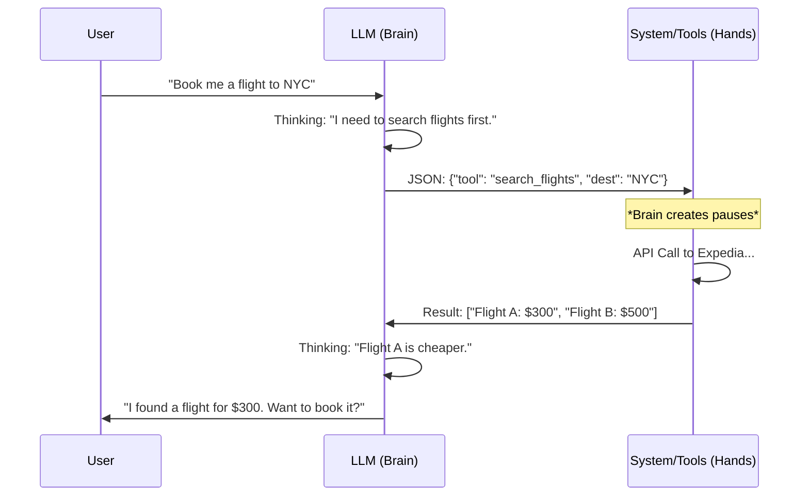

# Tool Calling: From "Talkers" to "Doers"

For the first few years (GPT-1, GPT-2), AI models were just **Text Generators**. 
*   You ask: "What is 234 * 49?" 
*   AI Predicts: "11000" (It might hallucinate because it's bad at math).

Now, models are **Action Takers** (Agents).
*   You ask: "What is 234 * 49?"
*   AI DECIDES: "I should use a calculator."
*   AI OUTPUTS: `{"tool": "calculator", "args": "234 * 49"}`

This shift is the foundation of the Agentic Future. The model is no longer just a poet; it is a **Coordinator** of software.

---

## 1. The Core Loop: The "ReAct" Pattern
How does a text model "take action"? It follows a loop often called **ReAct** (Reasoning + Acting).

1.  **User**: "What is the weather in Tokyo?"
2.  **Model (Thinking)**: "I don't know the weather. I have a tool called `get_weather`. I should call it."
3.  **Model (Output)**: **STOP GENERATING TEXT**. Instead, generate a specific special token or JSON: `CALL: get_weather("Tokyo")`.
4.  **System (Code)**: *Pauses* the AI. Runs the actual Python function `get_weather("Tokyo")`. Gets result `"Sunny, 25C"`.
5.  **System (Feedback)**: Feeds this result back to the AI as a new message.
6.  **Model**: "Ah, the result is Sunny. Now I can answer." -> "It is sunny in Tokyo."

---

## 2. Why is this hard?
The model has to be smart enough to:
1.  **Know when to shut up**: Don't hallucinate an answer ("It is raining"). detailedly deciding to *outsource* the task.
2.  **Format correctly**: If the API needs `{"city": "Tokyo", "unit": "celsius"}`, the model must generate *exactly* that JSON. One missing comma breaks the code.
3.  **Handle Errors**: If the tool returns "Error: City not found", the model must try again or ask the user for clarification.

---

## 3. Code Corner: Building a Simple Tool User
Here is a simulation of how OpenAI Function Calling works under the hood.

```python
import json

# 1. THE TOOLS
def get_weather(location):
    if "tokyo" in location.lower():
        return json.dumps({"temp": "25", "condition": "Sunny"})
    else:
        return json.dumps({"temp": "20", "condition": "Cloudy"})

tools_registry = {
    "get_weather": get_weather
}

# 2. THE SYSTEM PROMPT
system_prompt = """
You have access to the following tools:
- get_weather(location: str): Returns weather info.

If you visualize a need for a tool, output JSON: {"function": "name", "args": "value"}
"""

# 3. SIMULATED LLM (This represents what GPT-4 does internally)
def mock_llm_decision(user_input):
    if "weather" in user_input.lower():
        # The model "decides" to call a tool
        return '{"function": "get_weather", "args": "Tokyo"}'
    else:
        return "I am just a chat bot."

# 4. THE AGENT LOOP
def run_agent(user_query):
    print(f"USER: {user_query}")
    
    # Step A: Ask Model
    response = mock_llm_decision(user_query)
    
    # Step B: Check if Model wants to act
    if "{" in response:
        print(f"AI DECISION: {response}")
        action = json.loads(response)
        tool_name = action["function"]
        tool_args = action["args"]
        
        # Step C: Execute Code
        print(f"SYSTEM: Running {tool_name}('{tool_args}')...")
        result = tools_registry[tool_name](tool_args)
        print(f"OBSERVATION: {result}")
        
        # Step D: Final Answer (Normally we feed result back to LLM)
        final_answer = f"The weather in {tool_args} is {json.loads(result)['condition']}."
        print(f"AI FINAL: {final_answer}")
        
    else:
        print(f"AI: {response}")

# RUN IT
run_agent("What's the weather in Tokyo?")
```

---

## 4. Visual Summary: The "Brain & Hands" Architecture



## Summary
*   **Old AI**: Read Text -> Write Text.
*   **New AI (Agents)**: Read Text -> **Decide Action** -> **Wait for Result** -> Write Text.
*   This simple loop allows LLMs to use Calculators, browse the Web, query Databases, and control Robots.

---

## 5. Model Compatibility: Who Can Do This?

Not every model is smart enough to handle Tool Calling reliably.

### A. The "Native" Tool Users (Best)
These models were specifically trained to output JSON when asked. They almost never fail syntax.
*   **OpenAI GPT-4o / GPT-4-turbo**: The gold standard. Supports parallel function calling (calling 5 tools at once).
*   **OpenAI GPT-3.5-turbo (newer versions)**: Good, faster, cheaper.
*   **Claude 3.5 Sonnet / Opus**: extremely capable tool user.
*   **Llama 3 (Instruct)**: Has specific tokens for tool use.

### B. The "Prompted" Tool Users (Okay)
These models aren't trained for it, but you can force them via prompt engineering ("Please output JSON...").
*   **Mistral 7B / Older Llama 2**: they often mess up the JSON format (forgetting a `}` or adding text like "Here is your JSON:").
*   **GPT-3 (DaVinci) / Base Models**: These generally **cannot** do tool calling reliably. They just want to write paragraphs.

### C. Legacy OpenAI Models (Do NOT Use)
*   **`gpt-3.5-turbo-instruct`**: This is a completion model, not a chat model. It does not support the formal `tools` API parameter.
*   **`text-davinci-003` (Deprecated)**: The old king, but dumb at tools.

